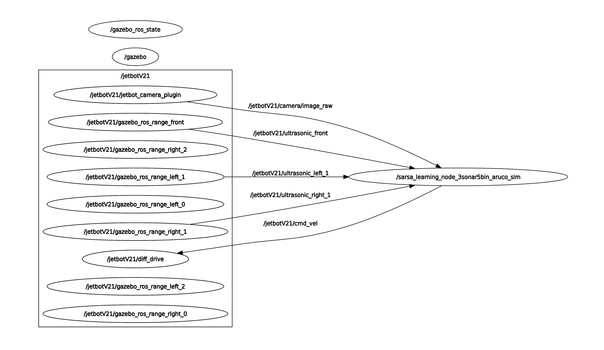
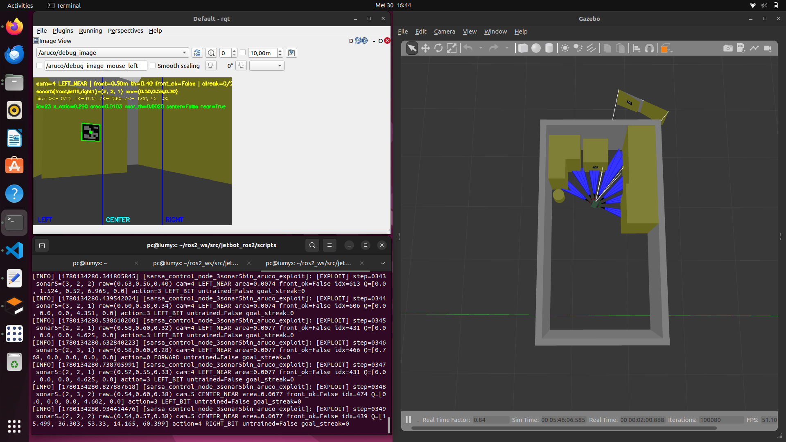
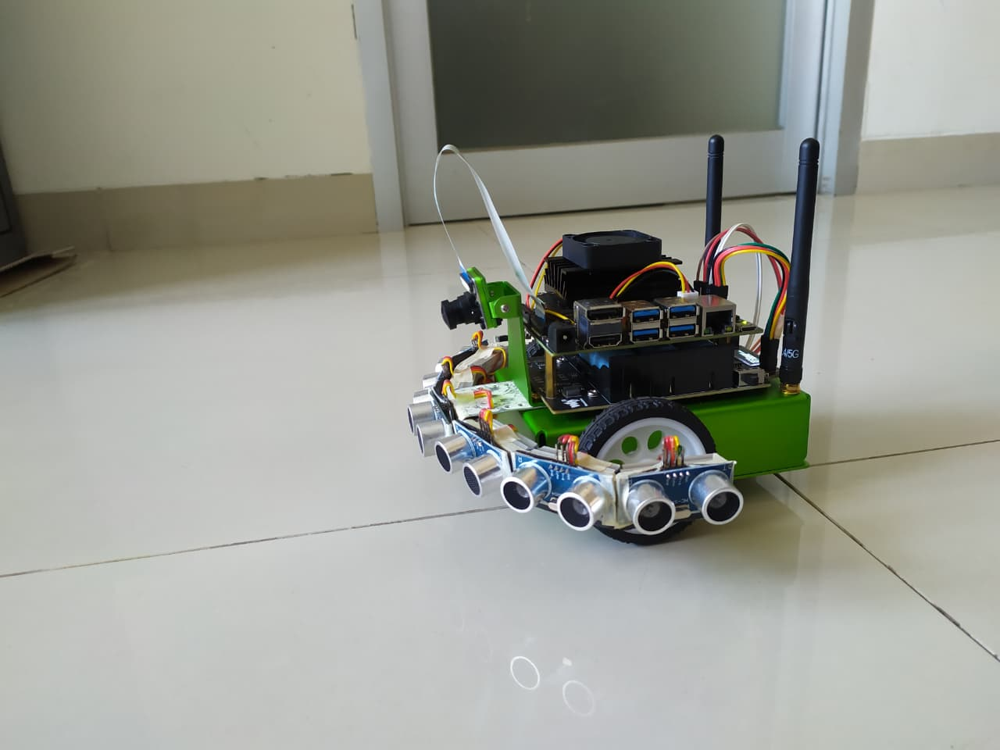

# JetBot HITL-SARSA Navigation using ROS2

Implementation of Human-in-the-Loop SARSA (HITL-SARSA) for autonomous navigation on NVIDIA JetBot using ROS2 Humble and Gazebo.

---

# Overview

This repository contains the implementation used in my undergraduate thesis research on:

* SARSA Reinforcement Learning
* Human-in-the-Loop SARSA (HITL-SARSA)
* ROS2 Humble
* Gazebo Simulation
* NVIDIA JetBot Deployment
* ArUco-based Goal Detection

The objective is to improve training efficiency by allowing human intervention during reinforcement learning.

---

# System Architecture

<p align="center">
  
</p>

---

# Simulation Environment Setup

## Operating System

* Ubuntu 22.04 LTS

## ROS2 Installation

Install ROS2 Humble following the official installation guide:

https://docs.ros.org/en/humble/Installation/Ubuntu-Install-Debs.html

Install required packages:

```bash
sudo apt update

sudo apt install -y \
    python3-colcon-common-extensions \
    python3-pip

pip install -r requirements.txt
```

Setup environment:

```bash
echo "source /opt/ros/humble/setup.bash" >> ~/.bashrc
source ~/.bashrc
```

---

## Gazebo Installation

This project was developed using Gazebo Classic (Gazebo 11).

Install Gazebo:

```bash
sudo apt install gazebo
```

Verify installation:

```bash
gazebo --version
```

---

# Clone Repository

Create workspace:

```bash
mkdir -p ~/ros2_ws/src
cd ~/ros2_ws/src
```

Clone repository:

```bash
git clone https://github.com/YOUR_USERNAME/jetbot_ros2.git
```

Build workspace:

```bash
cd ~/ros2_ws

colcon build --symlink-install

source install/setup.bash
```

---

# Arduino Setup

Flash the Serial-Arduino for Ultrasonic Sensor located in:

```text
src/arduino/
```

This program responsible for publishing ultrasonic sensor measurements to ROS2.


---

# Running Simulation

Launch Gazebo world:

```bash
ros2 launch jetbot_ros gazebo_world.launch.py
```

---

## SARSA Training

```bash
python3 learn_aruco.py
```

---

## HITL-SARSA Training

```bash
python3 learn_aruco_hitl.py
```

---

# Simulation Screenshot

<p align="center">
  
</p>

---

# Real Robot Setup

The real robot platform is based on Waveshare NVIDIA JetBot.

---

## Docker Installation

```bash
sudo apt install docker.io

sudo usermod -aG docker $USER
```

Re-login after adding docker group.

---

## Pull ROS2 Docker Image

```bash
docker pull ros:humble
```

---

## Run Container

```bash
docker run -it \
  --name jetbot_ros2 \
  --network host \
  --privileged \
  -v /home/user/ros2_ws:/root/ros2_ws \
  -v /dev:/dev \
  -w /root/ros2_ws \
  ros:humble
```

---

## Install Dependencies Inside Container

```bash
apt update

apt install -y \
    python3-colcon-common-extensions \
    python3-pip

pip install -r requirements.txt
```

Build workspace:

```bash
colcon build
```

Configure environment:

```bash
echo "source ~/ros2_ws/install/setup.bash" >> ~/.bashrc

echo "source /opt/ros/humble/setup.bash" >> ~/.bashrc

source ~/.bashrc
```

Install Python dependencies:

```bash
pip install pyserial

pip install Adafruit-MotorHAT
```

Install I2C packages:

```bash
apt install -y python3-smbus i2c-tools
```

---

## Verify Motor Driver

Check I2C devices:

```bash
i2cdetect -y -r 1
```

Expected motor driver address:

```text
0x41
```

Adjust the ROS motor node configuration if a different address is detected.

---

# Launch JetBot ROS Node

```bash
ros2 launch jetbot_ros jetbot_nvidia.launch.py
```

---

# Real Robot Commands

## Pure Exploitation

```bash
python3 control_35_real.py \
  --ros-args \
  -p sensor_prefix:=/jetbotV21 \
  -p sonar_msg_type:=float32 \
  -p sonar_input_unit:=cm \
  -p udp_bind_host:=0.0.0.0 \
  -p udp_port:=5020 \
  -p q_table_path:=/ros2_ws/src/jetbot_ros2/scripts/data/Q_table_3sonar5bin_gazebo_sim.csv \
  -p unknown_state_policy:=safe_random \
  -p aruco_near_area_ratio:=0.006 \
  -p goal_front_threshold_m:=0.38 \
  -p camera_left_boundary_ratio:=0.35 \
  -p camera_right_boundary_ratio:=0.65 \
  -p log_every:=1
```

---

## Fine-Tuning with HITL

```bash
python3 control_35_real_hitl.py \
  --ros-args \
  -p sensor_prefix:=/jetbotV21 \
  -p sonar_msg_type:=float32 \
  -p sonar_input_unit:=cm \
  -p front_zero_as_max:=true \
  -p front_zero_fallback_m:=1.5 \
  -p udp_bind_host:=0.0.0.0 \
  -p udp_port:=5020 \
  -p q_table_path:=/ros2_ws/src/jetbot_ros2/scripts/data/Q_table_3sonar5bin_real_hitl.csv \
  -p hitl_on_unknown:=true \
  -p aruco_near_area_ratio:=0.006 \
  -p goal_front_threshold_m:=0.38 \
  -p camera_left_boundary_ratio:=0.35 \
  -p camera_right_boundary_ratio:=0.65 \
  -p log_every:=1
```

---

# ArUco Video Streaming

## Sender (JetBot)

```bash
python3 sender.py \
  --udp-host 127.0.0.1 \
  --udp-port 5020 \
  --extra-target 192.168.43.216:5021 \  ## Laptop IP
  --send-width 960 \
  --send-height 540 \
  --jpeg-quality 70 \
  --send-fps 30
```

---

## Receiver (Docker)

```bash
python3 receiver.py \
  --frame-port 5020 \
  --status-host 127.0.0.1 \
  --status-port 5010 \
  --target-id 23 \
  --dictionary DICT_6X6_250 \
  --min-area-ratio 0.01 \
  --center-tolerance-ratio 0.18
```

---

## Receiver (Laptop)

```bash
python3 receiver.py \
  --frame-bind-host 0.0.0.0 \
  --frame-port 5021 \
  --target-id 23 \
  --dictionary DICT_6X6_250 \
  --min-area-ratio 0.01 \
  --center-tolerance-ratio 0.18 \
  --show
```

---

# Real Robot Demonstration

<p align="center">
  
</p>

---

# Real Robot Video Demonstration

<p align="center">
  
</p>

---
